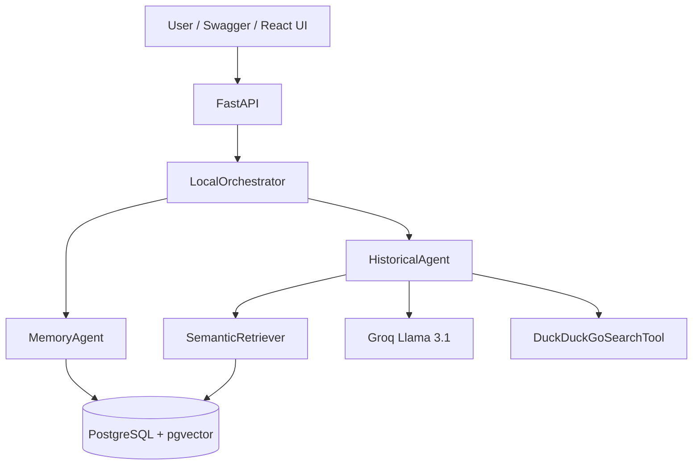

# Architecture — Historical Guide RAG Agent

## Overview

Autonomous MVP for a historical guide chatbot focused on Carthage, Tunisia. The system answers visitor questions using RAG (Retrieval-Augmented Generation) over structured Excel datasets stored in PostgreSQL with pgvector.

## Components

| Component | File | Responsibility |
|-----------|------|----------------|
| FastAPI app | `backend/app/main.py` | HTTP API, CORS, request logging |
| Chat route | `backend/app/api/routes_chat.py` | `POST /api/chat` |
| LocalOrchestrator | `backend/app/agents/local_orchestrator.py` | Load memory → answer → update memory |
| HistoricalAgent | `backend/app/agents/historical_agent.py` | Retrieve chunks, optional web fallback, call LLM, return sources |
| DuckDuckGoSearchTool | `backend/app/tools/web_search_tool.py` | Optional web search fallback (no API key) |
| MemoryAgent | `backend/app/agents/memory_agent.py` | Session preferences and message history |
| SemanticRetriever | `backend/app/rag/retriever.py` | Hybrid vector + keyword search |
| MemoryService | `backend/app/memory/memory_service.py` | DB persistence for sessions |

## Main request flow

1. Client sends `POST /api/chat` with `session_id`, `message`, `language`.
2. `LocalOrchestrator` loads or creates the session via `MemoryAgent`.
3. `HistoricalAgent` builds an enriched retrieval query (memory + follow-up hints).
4. `SemanticRetriever` returns top-k chunks from `document_chunks`.
5. If best score < `RAG_MIN_SCORE`, the agent returns a fixed insufficient-context answer (no LLM call), unless optional web search fallback is enabled.
6. When `WEB_SEARCH_ENABLED=true`, `HistoricalAgent` may call `DuckDuckGoSearchTool` as a controlled fallback for domain-related queries with insufficient local context or explicit online search requests.
7. Otherwise, LLM generates a grounded answer from retrieved chunks (and optional web context).
8. `MemoryAgent` stores messages and updates preferences.
9. API returns `answer`, `sources`, `memory_context`, `suggested_actions`.

## Integration boundary

This MVP includes a **local orchestrator only** for standalone testing. A future external multi-agent system should call `POST /api/chat` and treat this module as a black box.

The local orchestrator must not grow into a complex workflow engine. See `docs/integration_contract.md`.

## Database tables

| Table | Purpose |
|-------|---------|
| `destinations` | Tourist destinations |
| `monuments` | Monument records from Excel |
| `circuits` | Visit circuits |
| `circuit_monuments` | Circuit–monument relations |
| `document_chunks` | RAG text chunks + embeddings |
| `user_sessions` | Chat sessions |
| `chat_messages` | User/assistant message history |
| `user_preferences` | Session-level JSON preferences |

## Configuration

Key environment variables (see `.env.example`):

- `DATABASE_URL` — PostgreSQL connection
- `LLM_PROVIDER` / `LLM_API_KEY` / `LLM_MODEL_NAME` — Groq or `mock`
- `RAG_TOP_K` / `RAG_MIN_SCORE` — retrieval thresholds
- `WEB_SEARCH_ENABLED` / `WEB_SEARCH_PROVIDER` / `WEB_SEARCH_MAX_RESULTS` — optional DuckDuckGo fallback (default off)
- `LOG_LEVEL` — application logging (`INFO` default)

## Known limitations

- `destination_name` in chunk metadata is hardcoded to Carthage for most rows.
- DuckDuckGo web search is a fallback only; results are unverified and may be incomplete or rate-limited.
- No reservation, weather, or advanced circuit optimization.
- Monuments/circuits read API routes are not exposed; data is accessed via RAG and chat.
