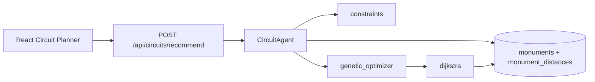

# CircuitAgent — Personalized visit circuits

## Role

`CircuitAgent` is an **algorithmic sub-agent** independent from the historical chat agent. It recommends optimized tourist circuits around Carthage based on visitor constraints and preferences.

It does **not** use an LLM for routing. The LLM-based `HistoricalAgent` remains unchanged.

## Architecture



| Module | Path | Responsibility |
|--------|------|----------------|
| CircuitAgent | `backend/app/agents/circuit_agent.py` | Orchestrates the pipeline |
| Data loader | `backend/app/circuits/data_loader.py` | Load monuments and graph from PostgreSQL |
| Constraints | `backend/app/circuits/constraints.py` | Budget, duration, mobility, must/avoid |
| Scoring | `backend/app/circuits/scoring.py` | Soft preference scoring per monument |
| Dijkstra | `backend/app/circuits/dijkstra.py` | Shortest travel time between consecutive stops |
| Genetic optimizer | `backend/app/circuits/genetic_optimizer.py` | Select and order monuments |
| Route builder | `backend/app/circuits/route_builder.py` | Schedule, totals, explanations |
| Map payload | `backend/app/circuits/map_payload.py` | Polyline and segment geometry |

## Hybrid algorithm

1. **Constraint filtering** — Remove excluded monuments, apply mobility and budget pre-checks, force required monuments.
2. **Scoring** — Rank candidates by historical period, function, popularity, budget and mobility fit.
3. **Genetic algorithm** — Evolve ordered subsets of monuments (population 40, 50 generations by default).
4. **Dijkstra** — For each consecutive pair in a chromosome, compute shortest travel time on the distance graph.
5. **Route builder** — Produce visit schedule, totals, explanations, and map payload.

The GA optimizes the **global circuit**. Dijkstra optimizes **legs** between stops.

## Datasets

| File | Usage |
|------|--------|
| `data/raw/csv/monuments.csv.csv` | Enriches `monuments` (coords, popularity, tariffs, visit duration) |
| `data/raw/csv/distances.csv` | Imported into `monument_distances` (weighted graph) |
| `data/raw/csv/circuits_optimises.csv` | Imported into `reference_circuits` (GA warm-start) |
| `data/raw/csv/Profile_clients.csv` | Test fixtures only (not stored in DB) |

Import command:

```bash
cd backend
python scripts/import_circuit_datasets.py
```

## Frontend

React + Vite UI in `frontend/simple-chat-ui/`:

- Nav item **Circuit** → `CircuitPlannerPage`
- Components under `src/components/circuits/`
- API client: `src/services/circuitApi.ts`

Map: **React-Leaflet** + OpenStreetMap tiles.

**Route geometry:** After a successful recommendation, the frontend calls the free [OSRM](https://project-osrm.org/) demo API to draw road-following polylines. Configure via:

| Variable | Default |
|----------|---------|
| `VITE_OSRM_ENABLED` | `true` |
| `VITE_OSRM_BASE_URL` | `https://router.project-osrm.org` |
| `VITE_OSRM_PROFILE` | `driving` |

If OSRM fails, the UI falls back to the backend straight-line polyline and shows “Tracé indicatif”.

## Limitations

- **Road geometry** — Backend returns indicative polylines; the React UI enhances the map with OSRM when available. Self-hosted OSRM can replace the public demo server via `VITE_OSRM_BASE_URL`.
- **Incomplete graph** — If `distances.csv` edges are missing, Dijkstra may use haversine fallback or skip connections; the circuit may contain fewer monuments.
- **Decision support** — Output is a recommendation aid, not a guaranteed real-world itinerary (opening hours, closures, ticketing queues are simplified).
- **Public transport** — Travel times use a proxy column when no dedicated public-transport durations exist in the dataset.
- **Independent from chat** — `POST /api/chat` and `LocalOrchestrator` are not modified.

## Manual tests

### Test 1 — Student, budget 30, walking, 120 min, Romaine

- **Input:** `type_tarif=etudiant`, `budget_max=30`, `transport=walking`, `duration_minutes=120`, `epoques=["Romaine"]`
- **Expected:** `constraints.budget_ok` and `duration_ok` true; map shows markers and orange polyline.

### Test 2 — Low budget, 60 minutes

- **Input:** `budget_max=10`, `duration_minutes=60`
- **Expected:** Few monuments; `budget_ok` true.

### Test 3 — must_visit Thermes d'Antonin

- **Input:** `preferences.must_visit=["Thermes d'Antonin"]`
- **Expected:** Thermes d'Antonin appears first in `circuit.monuments`.

### Test 4 — avoid Tophet

- **Input:** `preferences.avoid=["Tophet"]`
- **Expected:** Tophet not in the route.

### Test 5 — Impossible constraints

- **Input:** `budget_max=1`, `duration_minutes=15`, `must_visit=["Thermes d'Antonin"]`
- **Expected:** HTTP 422 with a clear error message.

## Related docs

- [api_reference.md](api_reference.md) — Request/response schemas
- [architecture.md](architecture.md) — System-wide architecture
